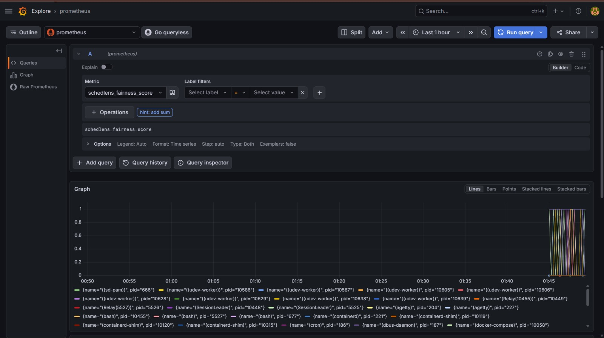
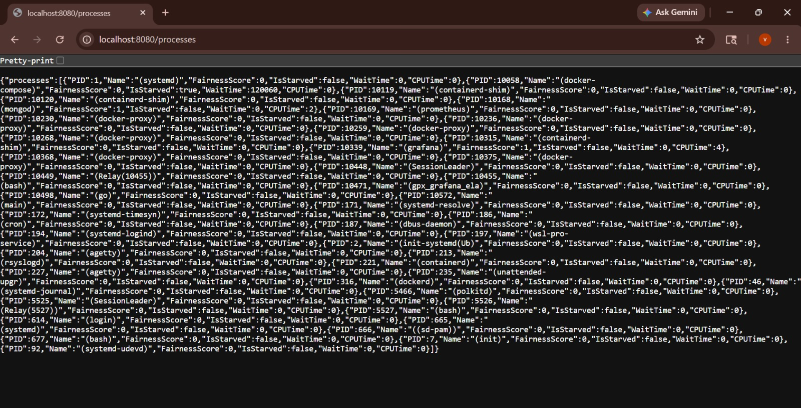

# SchedLens

A self-healing Linux scheduler monitor that detects starved processes and automatically adjusts kernel priority via syscalls without human intervention and visualizes everything in real time via Grafana.

---

## Why

The Linux kernel's CFS (Completely Fair Scheduler) is supposed to give every process equal CPU time. But sometimes processes get **starved** — they wait too long while others hog the CPU. This is invisible to most tools.

SchedLens makes the scheduler's behavior visible. It tells you:
- Which processes are getting a fair share of CPU
- Which processes are being starved
- How often processes are getting kicked off the CPU involuntarily

---

## How It Works

The Linux CFS gives every process a `vruntime` — a virtual clock that tracks how much CPU time it has used. CFS always picks the process with the **lowest vruntime** next. If a process's vruntime grows much slower than others, it's being starved.

SchedLens reads `/proc/[pid]/stat` and `/proc/[pid]/schedstat` every 2 seconds, compares snapshots, and calculates:

**Fairness Score (0 to 1):**
```
Fair share     = Total CPU delta / Number of processes
Fairness score = Process CPU delta / Fair share
```
A score of 1.0 means perfectly fair. Lower means the process is getting less than its share.

**Starvation Detection:**
```
If process state == "R" (runnable, not sleeping)
AND wait_time_delta > threshold
AND cpu_time_delta < minimum
AND consecutive starved checks >= 3
    → flag as STARVED
```
Key design decisions:
- Only runnable processes (state "R") can be starved — sleeping processes are waiting on I/O, not the scheduler
- Requires 3 consecutive checks — prevents false positives from momentary spikes
- Resets tick count if process recovers between checks

**Context Switch Rate:**
```
switch_rate = (current_switches - previous_switches) / time_delta
```
High involuntary switches means the process keeps getting kicked off the CPU.

**Self-Healing:**
```
If process is starved for 3 consecutive checks:
    → Check current nice value
    → If nice == 0 (user hasn't set it): boost to nice -5 via syscall
    → Start 30 second cooldown before re-evaluating
    → If process recovers: rollback to nice 0 automatically
    → If process dies while boosted: cleanup to prevent memory leak
```
SchedLens never touches processes the user has manually prioritized (nice ≠ 0).

---

## Architecture

```
main goroutine
    ↓
Collector goroutine (reads /proc every 2s)
    ↓
Engine goroutine (calculates metrics + starvation ticks)
    ↓
Fan-out simultaneously:
    ├── OTel Exporter  → Prometheus → Grafana
    ├── MongoDB        → historical snapshots
    ├── CLI            → live terminal table
    └── Healer         → renice starved processes
```

Everything communicates via channels. No shared memory. No mutexes.

---

## Tech Stack

| Component | Technology | Purpose |
|-----------|-----------|---------|
| Core | Go | Main application |
| Metrics Export | OpenTelemetry + Prometheus | Real time metrics |
| Visualization | Grafana | Dashboard |
| Historical Storage | MongoDB | Snapshot replay |
| HTTP API | Gin | Query historical data |
| Infrastructure | Docker Compose | One command setup |

---

## Metrics Exported

| Metric | Type | Description |
|--------|------|-------------|
| `schedlens_fairness_score` | Gauge | CPU fairness per process (0 to 1) |
| `schedlens_is_starved` | Gauge | Whether process is starved (0 or 1) |
| `schedlens_wait_time_delta` | Counter | How much wait time increased |
| `schedlens_cpu_time_delta` | Counter | How much CPU time increased |
| `schedlens_switch_rate` | Gauge | Context switches per second |

All metrics are labelled with `pid` and `name`.

---

## API Endpoints

| Endpoint | Description |
|----------|-------------|
| `GET /health` | Returns `{"status": "ok"}` |
| `GET /processes` | Current live process list with metrics |
| `GET /history?pid=1234&from=<RFC3339>&to=<RFC3339>` | Historical scheduler data for a process |
| `GET /starvation` | Currently starved processes |

---

## Running Locally

**Prerequisites:** Docker, Go 1.21+

```bash
# Clone the repo
git clone https://github.com/Luffy-nani/SchedLens
cd SchedLens

# Start Prometheus, Grafana, MongoDB
docker compose up -d

# Run SchedLens (sudo required for renice)
sudo go run cmd/main.go
```

Then open:
- `localhost:8080/health` — API health check
- `localhost:9090` — Prometheus
- `localhost:3000` — Grafana (admin/admin)

---

## Screenshots

<h4>Grafana Dashboard</h4>



<h4>Prometheus metrics</h4>



---

## What I Learned

- **How Linux CFS actually works** — vruntime, the red-black tree, why processes get starved
- **`/proc` internals** — what each field in `/proc/[pid]/stat` and `/proc/[pid]/schedstat` actually means at the kernel level
- **OpenTelemetry** — how OTel sits between your app and Prometheus, and why that abstraction matters
- **Go concurrency patterns** — goroutines, channels, fan-out pipelines, why Go's model avoids mutexes
- **Observability stack** — how Prometheus scrapes metrics and how Grafana queries Prometheus to build dashboards
- **Linux syscall package** — how to call kernel syscalls directly from Go using `syscall.Setpriority` and `syscall.Getpriority` instead of spawning subprocesses
- **Edge case thinking** — starvation detection has many false positive traps: sleeping processes, momentary spikes, double-boosting, dead process cleanup. Each required a specific fix.